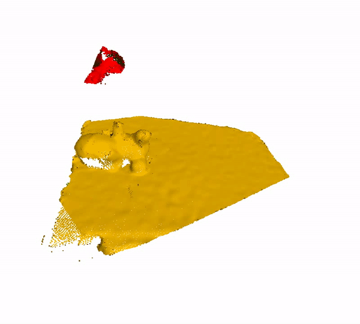

# Scene Level Tracking And Reconstruction without object prior

  

Generate the geometry model, tracking the position and deformation for each visible individual objects in the scene **without** object prior. 

### More results on challenging scenes (RGB, Model, Segmentation)

  

  

### Comparison with SurfelWarp (Right)

 

### Interactive demo (Ongoing)

An interacitve is also provided for better evaluation of our results. [Interactive demo](https://changhaonan.github.io/Easy3DViewer/
)